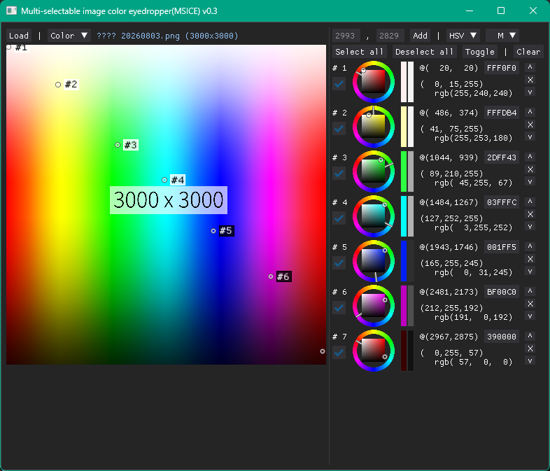

# 複数箇所スポイトできる画像カラースポイトツール



工事中

> [!NOTE]
> 甘い作りによりスポイトツールの割にRAM/VRAMを使用します。不必要に大きな画像も縮小せず、カラー画像とグレースケール画像の両者をVRAMへ転送しているなどのためです。
> 4000x3000px程度の画像を読み、カラーとグレーの両方がロードされた状態ではRAM 400MB、VRAM 300MB程度使用されます...

## 実行

```bash
\$ python -m venv venv   # venvの使用は任意
\$ .\\venv\\Scripts\\activate # Windows版venvの場合
\$ pip install -r requirements.txt
\$ python main.py
```

## その他

- ズーム?
  - ズーム以外に拡大状態での移動、拡大状態でのクリック位置から該当ピクセルの算出、スポイト位置インジケーターの適切な位置への描画など考えることが多いため実装されそうにありません
- グレースケール
  - グレースケール表示、色リスト内での表示ともにITU-R 601-2 luma transformです
  - `L = R * 299/1000 + G * 587/1000 + B * 114/1000` [(参考(Pillowドキュメント))](https://pillow.readthedocs.io/en/stable/reference/Image.html#PIL.Image.Image.convert)
- 不足
  - もう少し良い左右パネルレイアウト
  - バッファ最大画像サイズ指定


## 更新履歴

### v0.5

- HSV(~255), RGB(%), HLS(360,100)的表記
  - 例:
    - HSV(255) → `HSV(255, 255, 255)`
    - HSV(%)   → `HSV(100, 100, 100)`
    - HSV(360,%) → `HSV(360, 100, 100)`
- カラーサークル回転オフセット
  - HSV, RGB表示時のカラーサークルの色相環の回転オフセットを指定できる
    - HLS時はGUIライブラリによるカラーサークルを使用しており、それが回転オフセットオプションを提供していないため指定できない
  - 起動時にコマンドライン引数`--rotate-circle 度`を与える
  - 一周360度の反時計回りで扱う。例えば、3時の位置に色相0が来て欲しい場合: `python ./main.py --rotate-circle -150`
